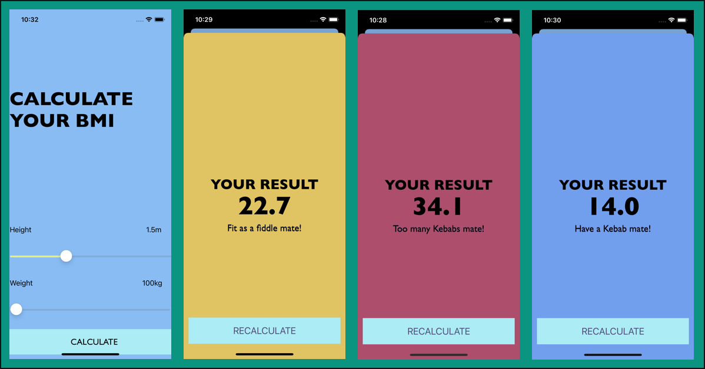
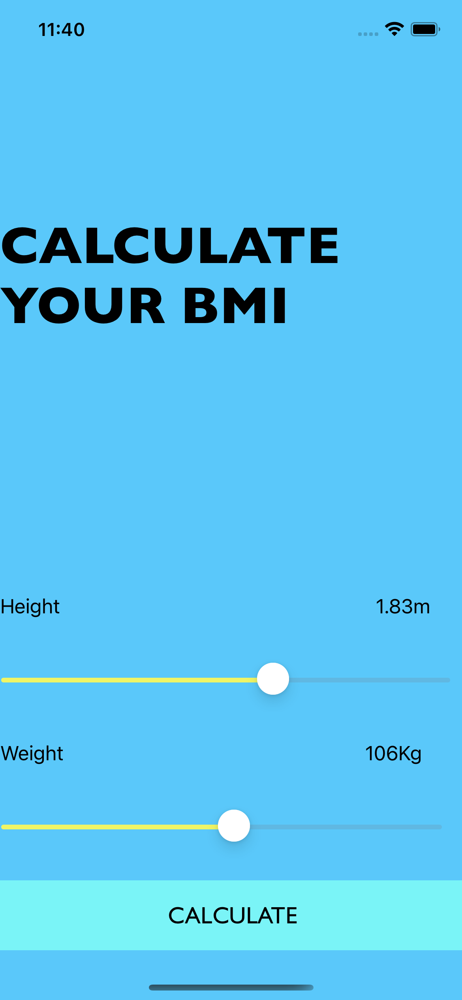

# izBMI

izBMI is a Body Mass Index calculator in your pocket. An easy to use iOS application that when you move both available Sliders left or right to adjust your weight and height, then hit the calculate button. Different colours determine the different categories.

## Screenshots

## What is BMI?

Body mass index (BMI) is a person’s weight in kilograms divided by the square of height in meters, it determine whether you are in a healthy weight range for your height. BMI is an inexpensive and easy screening method for weight category—underweight, healthy weight, overweight, and obesity.
It is useful to consider BMI alongside waist circumference, as waist measurement helps to assess risk by measuring the amount of fat carried around your middle.
BMI is a useful measurement for most people over 18 years old. But it is only an estimate and it doesn’t take into account age, ethnicity, gender and body composition. 
BMI does not measure body fat directly, but BMI is moderately correlated with more direct measures of body fat. Furthermore, BMI appears to be as strongly correlated with various metabolic and disease outcome as are these more direct measures of body fatness

## How is BMI interpreted for adults?

For adults 20 years old and older, BMI is interpreted using standard weight status categories. These categories are the same for men and women of all body types and ages.

## BMI is not interpreted the same way for adults as it is for children and teens

BMI is interpreted differently for children and teens, even though it is calculated using the same formula as adult BMI. Children and teen’s BMI need to be age and sex-specific because the amount of body fat changes with age and the amount of body fat differs between girls and boys. 

BMI 	Weight Status

* Below 18.5 	*Underweight*

* 18.5 – 24.9 	*Normal or Healthy Weight*

* 25.0 – 29.9 	*Overweight*

* 30.0 and Above 	*Obese*

**For example, here are the weight ranges, the corresponding BMI ranges, and the weight status categories for a person who is 5′ 9″.**

Height 	Weight Range 	BMI 	Weight Status

5′ 9″ 	

* 124 lbs or less 	Below 18.5 	*Underweight*

* 125 lbs to 168 lbs 	18.5 to 24.9 	*Normal or Healthy Weight*

* 169 lbs to 202 lbs 	25.0 to 29.9 	*Overweight*

* 203 lbs or more 	30 or higher 	*Obese*

## HomeScreen

